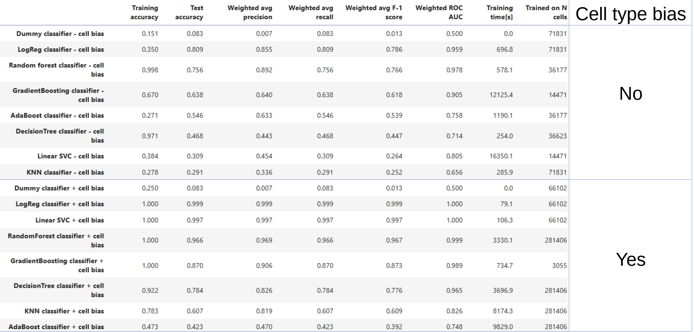
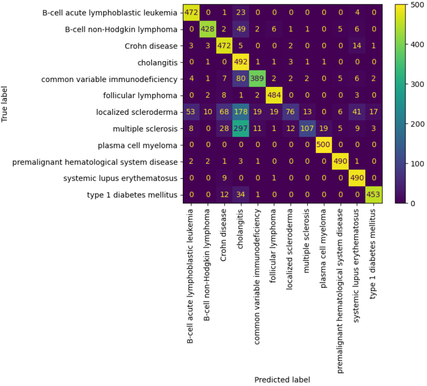

# Immune disease classifier

### Link to analysis:
Link to analysis: https://github.com/AdrianGrzybowski/Immune_diseases_classifier/blob/main/Analysis.ipynb

### Data Source:
CellxGene Census – a collection of single-cell transcriptomics data from multiple patients.
  
https://chanzuckerberg.github.io/cellxgene-census/

### Research Question:
Is it possible to build a model for multi-class classification of immune system malignancies and diseases? By observing single-cell transcriptomic states, can we predict the disease from a set of 12:

1. B-cell acute lymphoblastic leukemia
2. B-cell non-Hodgkin lymphoma
3. Crohn's disease
4. Cholangitis
5. Common variable immunodeficiency
6. Follicular lymphoma
7. Localized scleroderma
8. Multiple sclerosis
9. Plasma cell myeloma
10. Premalignant hematological system disease
11. Systemic lupus erythematosus
12. Type 1 diabetes mellitus

### Techniques Used in Analysis:
1. Each cell (entry) contains 50,000 features (genes), differential gene expression was performed to down-select only the most important features.
2. Cell types were balanced using synthetic cells generated through Poisson noise applied to real cells.
3. Multiple models were trained for multi-class prediction and tested on unseen patients to ensure high precision and recall.

### Expected Results:
1. A classifier capable of distinguishing between 12 immune system diseases, reliably diagnosing each patient with precision and high recall.

### Bussiness objectives:
1. This research aims to explore a novel data modality—single-cell transcriptomics—for diagnostics, which has not yet been widely applied in this domain. The development of a universal model capable of distinguishing between immune diseases using uniform molecular input, without relying on phenotypic data, could significantly enhance decision-making in medicine and supplement the $15B immune disease diagnostics market.
2. Currently, diagnostic tools predominantly rely on phenotypic markers, which can make it difficult to differentiate between diseases with overlapping clinical presentations. However, these diseases are distinguishable at the molecular level. This research seeks to harness molecular data to create a universal model for diagnosing immune diseases, even in the absence of additional phenotypic information.

### Data preprocessing:
1. There are 1,134,392 fake cells and 442,540 real cells and 71,063 cells that are augmented
2. Fake cells are cells added as decoys - they have incorrect disease labels, and exist to prevent the model from learning specific cell types, as it is not desirable behavior where sample bias betrays the disease type.
3. Real cells are actual real cells
4. Augmented cells are real cells with added poisson noise used to help cell type populations that are below 30 cells.
5. I have trained on datasets including and excluding fake cells - fake cells balance dataset so that model can't learn which cell type is disease associated which is beneficial from learning about specific disease gene networks but it makes the learning process much more difficult. 
6. I have merge both cholangitis-related diseases into single label. Primary sclerosing cholangitis and Primary biliary cholangitis are very simillar diseases and I have made decision to not differentiate between them.
7. In the real dataset there are very few donors for some diseases, which makes it hard to split data, as the split need to go along donor_id, the dataset with fake cells was also augmented to have more donor_ids by splitting original donors and randomly sampling cells from them and backfilling them with augmented and fake cells.
8. During Test/Train split, an effort was made to split cells along donor IDs and then guearantee 500 cells for each disease
9. Becasue training on the full dataset required prohibitive computer resources for dataset with fake cells I have used only 5% of the entire set and for dataset with real cells I have used 10% of the dataset.

### Analysis:
I have compared following models for multi-class classification task:
1. Dummy classifier
2. KNN classifier
3. Decision tree classifier
4. Logistic Regression classifier
5. Linear SVC

I have compared following datasets:
1. Dataset withouth cell type bias (augmented with fake cells whose job is to balance cell types so that network can't correleate cell type identities with diseases)
2. Dataset with cell type bias (model can use cell types to infer disease)
		
Note: hyperparameter search and 3-fold cross-validation was performed for every model using RandomizedSearchCV

### Metrics:
I have recorded:
1. Training Accuracy
2. Test Accuracy
3. Weighted average precision
4. Weighted average recall
5. Weighted average F-1 score
6. Weighted average ROC AUC
7. Trainig time

During randomized search cross-validation, the target metric was recall. High recall ensures that most true disease cases are detected, which is crucial for minimizing the risk of overlooking patients who require medical attention.

### Summary of all models:

### Confusion matrix for the best model with cell type bias - Logistic regression

### Confusion matrix for the best model without cell type bias - Logistic regression

### Observations:
1. Logistic regression and Linear kernel SVC achieved the best results from the perspective of recall, precision, and consequently F-1 score
2. Logisitc regression scales better than LinearSVC with the size of the dataset, considering that they produce similar results, Logisitc regression would be preferable for further expanding the model
3. The best models (Logistic Regression and SVC) for dataset without cell type bias struggle with localized sleroderma and type 1 diabetes, they also are the models with fewest donors, it is anticipated that accuracy of the prediction would increase with more patients in training. 

#### Number of donors per disease in the training set

#### Number of cells per disease in the training set

## Future Directions:
1. Current model performs inferences per cell, wheras multiple cells are available per patient, a model that could take multiple per cell predictions and use them for majority voting would give better results.
2. Current model does not predict whether patient is healthy, it would be critical to include healthy donors for each disease.
